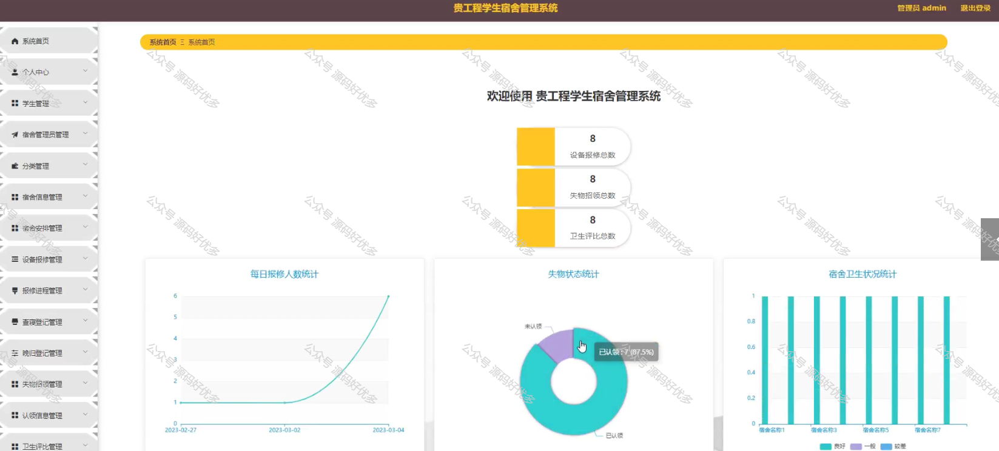
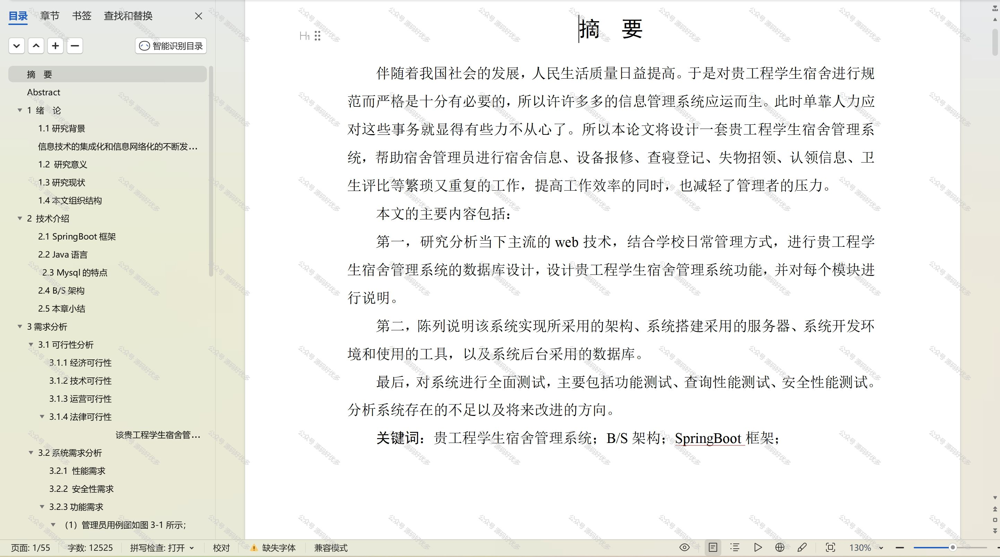

 
## 查看主页获取源码

### 一、作品包含

源码+数据库+设计文档万字+PPT+全套环境和工具资源+部署教程

### 二、项目技术

前端技术：Html、Css、Js、Vue、Element-ui

数据库：MySQL

后端技术：Java、Spring Boot、MyBatis

  

### 三、运行环境

开发工具：IDEA/eclipse

数据库：MySQL5.7

数据库管理工具：Navicat10以上版本

环境配置软件： JDK1.8+Maven3.6.3

前端Nodejs：14

### 四、项目介绍
项目编号：springbootA186

贵工程学生宿舍管理系统是为了提高学生宿舍管理水平、保障学生住宿安全以及优化宿舍资源配置而开发的。该系统通过信息化手段，实现对学生宿舍的日常管理，旨在为学生提供一个舒适、安全、便捷的居住环境，同时减轻宿舍管理人员的工作负担，提高工作效率。

前台用户功能：系统首页、个人中心、宿舍安排管理、设备报修管理、报修进程管理、查寝登记管理、晚归登记管理、认领信息管理、卫生评比管理、扣分信息管理、退宿信息管理、反馈信息管理。

后台分为管理员和宿舍管理员
管理员的功能：系统首页、个人中心、学生管理、宿舍管理员管理、分类管理、宿舍信息管理、宿舍安排管理、设备报修管理、报修进程管理、查寝登记管理、晚归登记管理、失物招领管理、认领信息管理、卫生评比管理、扣分信息管理、退宿信息管理、反馈信息管理、留言板管理以及系统管理。
宿舍管理员的功能：系统首页、个人中心、宿舍信息管理、宿舍安排管理、设备报修管理、报修进程管理、查寝登记管理、晚归登记管理、失物招领管理、认领信息管理、卫生评比管理。

### 五、运行截图

  
